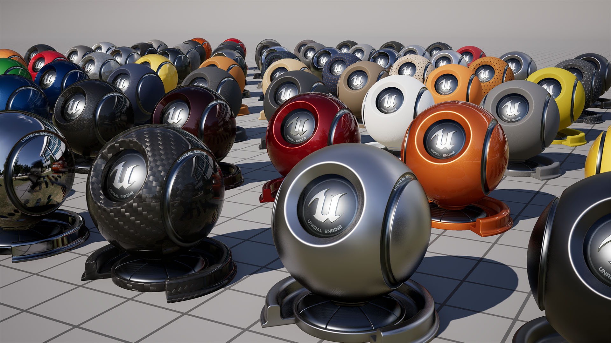

# Introdução

Quem trabalha ou estuda desenvolvimento de jogos sabe que a teoria do "Game Design Document perfeito" raramente sobrevive ao primeiro dia de produção. Sabemos que fazer um jogo não é apenas uma soma linear de arte, código e design. É um ecossistema caótico onde a visão criativa está em constante guerra com as limitações de hardware.

Você conhece os jogadores tradicionais: o Game Designer define as regras, o Artista cria visuais impressionantes no ZBrush ou Maya, e o Programador constrói a arquitetura lógica em C++ ou C#. Mas existe um abismo silencioso entre esses departamentos.

O Artista quer que o personagem tenha 50.000 polígonos e texturas 4K em cada peça da armadura. O Programador de Gameplay precisa que o jogo rode a 60 FPS no Switch e diz que o orçamento de memória estourou. O Animador reclama que a malha do ombro se deforma incorretamente quando o braço é levantado. Quem resolve esses impasses? Quem traduz a necessidade estética em viabilidade técnica?

É nesse vácuo que surge uma das figuras mais vitais e menos compreendidas da indústria: o **Technical Artist**.

# Definição

Definir um Technical Artist (TA) meramente como "alguém que sabe arte e programação" é uma simplificação grosseira. O TA é, essencialmente, o guardião do _pipeline_.

Pense no TA como um diplomata armado com profundo conhecimento técnico. Ele entende a dor do artista que odeia processos repetitivos e, simultaneamente, compreende a frustração do engenheiro com ativos não otimizados. A função primária do TA não é apenas criar ativos ou escrever gameplay, mas remover a fricção entre a criação de conteúdo e a implementação na engine.

Se a produção de jogos fosse uma rodovia, o Technical Artist seria o engenheiro de tráfego que garante que os carros (ativos) possam viajar na velocidade máxima sem causar engarrafamentos ou acidentes, independentemente de quantos veículos o departamento de arte decida colocar na pista.

# Áreas de atuação

Para visualizar onde o TA opera, vamos esquecer as listas e seguir o ciclo de vida de um ativo complexo, digamos, um "Chefe" final com tentáculos e pele translúcida.

O processo começa com a modelagem. O artista de personagens entrega uma escultura digital incrível. Mas para esse monstro se mover no jogo, ele precisa de um esqueleto. Aqui entra a primeira grande especialização do TA: **Rigging e Setup**. Não estamos falando apenas de colocar ossos; estamos falando de criar sistemas de deformação muscular, restrições complexas e interfaces de controle (UI) dentro do Maya ou Blender para que o animador possa focar na performance em vez de lutar contra a ferramenta.

Com o Chefe rigado e animado, ele precisa ir para a Engine. Exportar manualmente malhas, texturas e animações é um convite ao erro humano. Aqui o TA trabalha em **Pipeline e Ferramentas**. Ele escreve scripts em Python ou C# que automatizam essa ponte. O artista aperta um botão e o script valida convenções de nomenclatura, verifica a escala, exporta o FBX e importa para Unity ou Unreal com as configurações de compressão corretas.

Agora o Chefe está na cena, mas ele precisa parecer "viscoso". O material padrão da engine não serve. Entra em cena o **TA de Shaders e Lookdev**. Usando linguagens como HLSL/GLSL ou editores de nós (Shader Graph/Material Editor), o TA cria um shader personalizado que manipula vértices para pulsar como carne viva e calcula a refração da luz em tempo real para dar uma aparência translúcida, tudo isso sem destruir a performance da GPU.

Finalmente, o jogo começa a rodar devagar. A taxa de quadros cai. O Programador de Gameplay está ocupado com a IA e o Artista não sabe o que cortar. O TA coloca seu chapéu de **Otimização e Performance**. Ele abre o profiler da engine, analisa draw calls, uso de VRAM e custo de renderização por pixel. Ele encontra o gargalo e aplica uma solução cirúrgica, seja criando LODs (Level of Detail), ajustando o culling ou reescrevendo o shader para ser mais leve.

# Habilidades necessárias

Para navegar nesses mares agitados, o kit de ferramentas do Technical Artist precisa ser vasto. Não se espera que ele seja o melhor modelador do mundo, nem o melhor engenheiro de software, mas ele deve ser fluente em ambas as línguas.

A base fundamental é **Lógica de Programação e Scripting**. Python é a língua franca para ferramentas DCC (Digital Content Creation) como Maya e Blender. Para interagir com a engine e shaders, o domínio de C#, C++ e lógica baseada em nós é indispensável.

Mas a habilidade "difícil" que separa os curiosos dos profissionais é a **Matemática Aplicada**. Álgebra linear não é apenas uma matéria da faculdade aqui; é o dia a dia. Entender produtos escalar/vetorial, matrizes de transformação e espaço vetorial é crucial para criar shaders, rigs complexos e scripts de gameplay procedurais.

Além do código, existe o **Olhar Artístico**. O TA precisa olhar para uma imagem e entender o que está visualmente "errado" (iluminação, composição, cor) e saber como traduzir essa correção em números e parâmetros dentro da engine.

E talvez o mais importante de tudo: **Troubleshooting**. O TA é o bombeiro do projeto. Quando a build quebra, quando uma textura pisca ou uma sombra desaparece, todos olham para o TA. A habilidade de diagnosticar erros obscuros e investigar documentação técnica é o que mantém a produção viva.

# O caminho para se tornar um Technical Artist

Não existe uma estrada pavimentada para se tornar um TA. É um caminho para os "inquietos".

Geralmente, vemos dois perfis de origem. O primeiro é o **Artista Técnico**: aquele modelador ou animador que cansou do trabalho manual. Ele começou a aprender scripts para acelerar seu fluxo de trabalho, gostou da lógica por trás da cortina e percebeu que tinha mais talento para construir sistemas do que para pintar texturas.

O segundo é o **Engenheiro Criativo**: o programador que se sentia limitado pelo código backend invisível. Ele queria ver resultados visuais imediatos e queria entender renderização gráfica, luz e sombra. Ele mergulhou na Computação Gráfica e encontrou o casamento perfeito entre ciências exatas e visuais em shaders e otimização.

Se você já está na área e se pega frequentemente pensando "como posso fazer isso mais rápido?" ou "por que essa luz está reagindo assim?", você já está trilhando o caminho. O mercado está faminto por profissionais que conseguem transitar entre os hemisférios lógico e criativo do desenvolvimento. Ser um Technical Artist é, no fim das contas, ser o facilitador que permite que a mágica aconteça na tela, garantindo que a tecnologia sirva à arte, e não o contrário.

# Material extra

*   [Applying for a Technical Artist Job // Skills, Offers, CV](https://youtu.be/KPbgNX75E0w)
    
*   [So You Wanna Make Games?? | Episode 5: Technical Art](https://www.youtube.com/watch?v=kr7XYXMM7-U)
    
*   [Mastering Shader Programming & Technical Art with Harry | The Generalists Podcast](https://www.youtube.com/watch?v=PhlS-phZ1oE)
    
*   [Nature of Code - By Daniel Shiffman](https://natureofcode.com/)
    
*   [The Book of Shaders](https://thebookofshaders.com/)
    
*   [Online Free Book: Game Math](https://gamemath.com/book/intro.html)
    
*   [Online Free Book: Game Engine Architecture](https://www.gameenginebook.com/toc.html)
